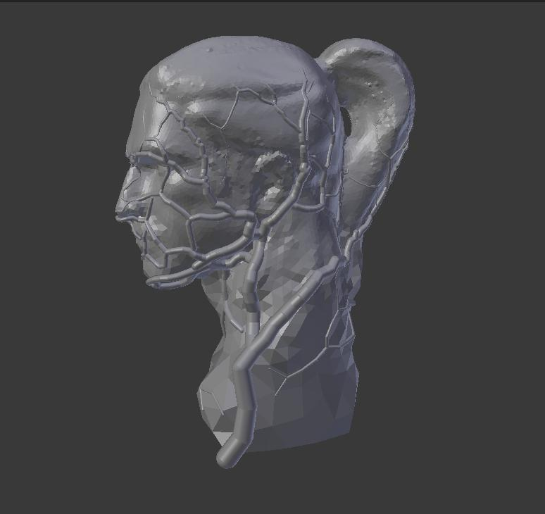
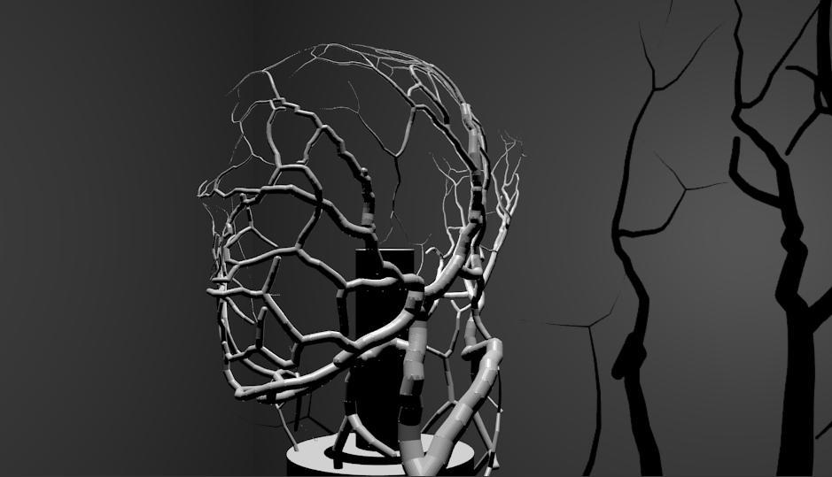

# Remeshing: Tree/roots wireframe

### Table of contents
* [Introduction](#introduction)
* [Results](#results)
* [Installing, configuring and running](#installation_configuration_running)

### Introduction
The goal of this project is to create a remeshing algorithm which would transform
a mesh into a tree/root like structure. The final goal is actually to 3d  print the
resulting mesh and use it as a lamp.

The final report can be found in the `report.pdf` file.

### Results

`final_mesh.obj` contains the final mesh of our project, which is ready to 3d
print.

This first image, shows the original mesh with the resulting mesh supperposed on
it.

A simulation of the resulting mesh with a light source in the middle (as a lamp would).

A video showing the gui, the generating process, and a simulation of the final mesh used as a lamp.

### Installation configuration running

All the necessary information for this project can be found in the `report.pdf`
file.

Instructions to run it can be found in the "Instructions" chapter of the
`report.pdf` file.
